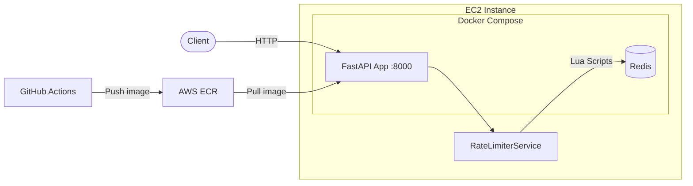

# Rate Limiter as a Service

Distributed rate limiting API supporting three algorithms, backed by Redis with atomic Lua scripts, deployed on AWS EC2 via GitHub Actions CI/CD.

## Architecture



**Request flow:** Client hits the API &rarr; service layer looks up the rule &rarr; selects algorithm &rarr; executes an atomic Lua script in Redis &rarr; returns allow/deny with remaining quota.

## Tech Stack

| Technology | Why |
|---|---|
| **Python 3.13** | Concise, async-native, huge ecosystem for web APIs |
| **FastAPI** | Async by default, auto-generated OpenAPI docs, Pydantic validation |
| **Redis** | Sub-millisecond reads, atomic operations via Lua, built-in TTL for auto-cleanup |
| **Docker + Compose** | Reproducible environments, single-command local dev, matches production |
| **GitHub Actions** | Free CI/CD for public repos, native Docker/ECR integration |
| **AWS EC2 (t3.micro)** | Free-tier eligible, full control over runtime, runs Docker Compose directly |
| **AWS ECR** | Private container registry in the same region as EC2, no egress costs |
| **Locust** | Python-native load testing, real-time web UI, scriptable user scenarios |

## API Documentation

Base URL: `http://localhost:8000` (local) or `http://<ec2-ip>:8000` (deployed)

Interactive docs available at `/docs` (Swagger UI) and `/redoc`.

### Create a rule

```bash
curl -X POST http://localhost:8000/api/v1/rules \
  -H "Content-Type: application/json" \
  -d '{
    "rule_id": "api_default",
    "algorithm": "token_bucket",
    "max_requests": 100,
    "window_seconds": 60,
    "refill_rate": 1.67
  }'
```

```json
{"rule_id":"api_default","algorithm":"token_bucket","max_requests":100,"window_seconds":60,"refill_rate":1.67}
```

### Check rate limit

```bash
curl -X POST http://localhost:8000/api/v1/check \
  -H "Content-Type: application/json" \
  -d '{"key": "user:123", "rule_id": "api_default"}'
```

```json
{"allowed":true,"remaining":99,"retry_after":null}
```

### Get status

```bash
curl http://localhost:8000/api/v1/status/user:123?rule_id=api_default
```

```json
{"key":"user:123","rule_id":"api_default","allowed":true,"remaining":98,"retry_after":null}
```

### List rules

```bash
curl http://localhost:8000/api/v1/rules
```

### Delete a rule

```bash
curl -X DELETE http://localhost:8000/api/v1/rules/api_default
```

```json
{"deleted":true,"rule_id":"api_default"}
```

### Health check

```bash
curl http://localhost:8000/api/v1/health
```

## Running Locally

```bash
# Clone and start
git clone https://github.com/biswajeet-cray/rate-limiter.git
cd rate-limiter
docker compose up -d

# Verify
curl http://localhost:8000/api/v1/health

# View logs
docker compose logs -f api

# Stop
docker compose down
```

**Without Docker** (development):

```bash
python -m venv venv
source venv/bin/activate        # Windows: venv\Scripts\activate
pip install -r requirements.txt

# Start Redis separately, then:
RATELIMITER_STORAGE_BACKEND=memory uvicorn main:app --reload
```

## Rate Limiting Algorithms

### Token Bucket

Allows bursty traffic up to a maximum bucket size, then enforces a steady refill rate.

- Bucket starts full at `max_requests` tokens
- Each request consumes 1 token
- Tokens refill continuously at `refill_rate` per second
- **Best for:** APIs that want to allow short bursts while enforcing an average rate

```
Bucket: [####______]  4/10 tokens
         ↑ refilling at 1.67/sec
```

### Fixed Window

Divides time into fixed intervals and counts requests per window.

- Time is split into windows of `window_seconds` each
- Counter increments per request, resets at window boundary
- **Best for:** Simple quotas like "100 requests per minute"
- **Trade-off:** Susceptible to boundary bursts (2x limit across two adjacent windows)

```
Window 1        Window 2
[||||||||  ]    [||        ]
 8/10 used       2/10 used
```

### Sliding Window

Maintains a timestamped log of requests and counts only those within the trailing window.

- Stores each request's timestamp in a Redis sorted set
- On each check, prunes timestamps older than `window_seconds`
- Remaining count = `max_requests` minus active timestamps
- **Best for:** Strict rate enforcement without boundary issues
- **Trade-off:** Higher memory usage (one entry per request vs. one counter)

```
now - 60s                    now
|----[--x--x---x--x--x-x-]--|
      5 requests in window
```

## Load Test Results

Tests run with [Locust](https://locust.io/) against an EC2 t3.micro instance. Traffic mix: 80% check, 15% status, 5% rule listing.

<!-- Replace the placeholder numbers below with actual results from run_load_tests.sh -->

| Users | Total Reqs | RPS | p50 (ms) | p95 (ms) | p99 (ms) | Error % |
|------:|-----------:|----:|---------:|---------:|---------:|--------:|
| 10    | —          | —   | —        | —        | —        | —       |
| 50    | —          | —   | —        | —        | —        | —       |
| 100   | —          | —   | —        | —        | —        | —       |

**How to reproduce:**

```bash
pip install -r requirements.txt
bash run_load_tests.sh http://<ec2-ip>:8000
# Results saved to results/ directory
```

### Key Findings

<!-- Fill in after running load tests. Example findings: -->
- Token bucket and fixed window checks complete in under X ms at p95 with 100 concurrent users
- Sliding window is slightly slower due to sorted set operations but still well under X ms
- The t3.micro instance handles ~X requests/second before CPU becomes the bottleneck
- Error rate stays at 0% up to 100 users (429s from rate limiting are expected, not errors)

## Project Structure

```
rate-limiter/
├── main.py                        # FastAPI app entry point, lifespan management
├── config.py                      # Pydantic settings (env vars)
├── algorithms/
│   ├── token_bucket.py            # Token bucket algorithm (Python)
│   ├── fixed_window.py            # Fixed window algorithm (Python)
│   └── sliding_window.py          # Sliding window algorithm (Python)
├── routers/
│   ├── check.py                   # POST /check, GET /status, GET /health
│   └── rules.py                   # CRUD for rate limit rules
├── models/
│   ├── requests.py                # Pydantic request models
│   └── responses.py               # Pydantic response models
├── services/
│   └── rate_limiter_service.py    # Business logic, algorithm routing
├── storage/
│   ├── redis_backend.py           # Redis client + Lua scripts
│   └── memory_backend.py          # In-memory backend for testing
├── tests/
│   ├── test_token_bucket.py       # Token bucket unit tests
│   ├── test_fixed_window.py       # Fixed window unit tests
│   ├── test_sliding_window.py     # Sliding window unit tests
│   ├── test_api.py                # FastAPI integration tests
│   └── test_redis_backend.py      # Redis backend integration tests
├── locustfile.py                  # Load test scenarios
├── run_load_tests.sh              # Run Locust at 10/50/100 users
├── deploy.sh                      # EC2 deployment script
├── Dockerfile                     # Multi-stage production build
├── docker-compose.yml             # Local development
├── docker-compose.prod.yml        # Production (pulls from ECR)
├── .github/workflows/ci.yml       # CI/CD pipeline
└── requirements.txt               # Python dependencies
```

## Design Decisions

### Why Redis?

Rate limiting needs sub-millisecond state checks on every request. Redis is single-threaded (no lock contention), keeps data in memory, and supports TTL for automatic cleanup. In a distributed setup with multiple API instances, Redis acts as the shared source of truth — every instance sees the same counters.

### Why Lua Scripts?

Without Lua, a rate limit check requires: read counter → check limit → increment → write back. In a distributed system, two requests can read the same counter simultaneously and both think they're under the limit — a classic TOCTOU race condition.

Redis executes Lua scripts atomically (no other commands interleave). This guarantees correctness without external locks or transactions. It's the same principle as database stored procedures but with Redis's speed.

### Why These Three Algorithms?

They represent the spectrum of rate limiting trade-offs:

- **Token bucket:** Industry standard (used by AWS, Stripe). Smooth enforcement with configurable burst tolerance.
- **Fixed window:** Simplest to understand and implement. Minimal memory (one counter per key). Good enough for many use cases.
- **Sliding window:** Most accurate enforcement. No boundary exploits. Worth the extra memory when precision matters.

Supporting all three lets consumers pick the right trade-off for their use case.

### Why FastAPI?

Async request handling pairs well with Redis I/O. Automatic OpenAPI documentation means the API is self-documenting. Pydantic validation catches malformed requests before they reach business logic. For a service that needs to handle high throughput with minimal latency, async Python is a practical choice.

### Why Docker Compose on EC2 (Not ECS/Kubernetes)?

This is a single-service deployment on a free-tier t3.micro. ECS or Kubernetes would add complexity and cost without proportional benefit at this scale. Docker Compose gives us multi-container orchestration, health checks, and restart policies — everything needed for a reliable single-node deployment. The architecture is container-ready, so migrating to ECS or Kubernetes later is a configuration change, not a rewrite.

## What I'd Add With More Time

- **Horizontal scaling:** Multiple API instances behind an ALB, all pointing at the same Redis cluster
- **Redis Sentinel / Cluster:** High availability and automatic failover for Redis
- **Kubernetes (EKS):** Auto-scaling, rolling deployments, self-healing pods
- **Grafana + Prometheus dashboard:** Real-time visualization of request rates, latencies, and throttle counts per rule
- **Rate limit headers:** Standard `X-RateLimit-Limit`, `X-RateLimit-Remaining`, `X-RateLimit-Reset` headers on every response
- **API key authentication:** Tie rate limits to authenticated API keys instead of arbitrary string keys
- **Rule persistence:** Store rules in Redis or a database so they survive restarts
- **Webhook notifications:** Alert when a key is consistently hitting its limit
- **Multi-region deployment:** Geo-distributed rate limiting with Redis cross-region replication
