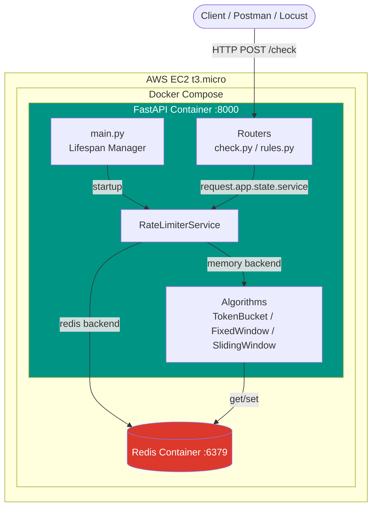
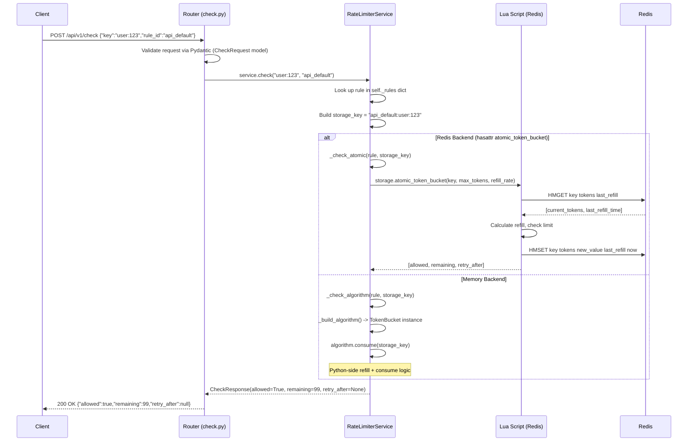
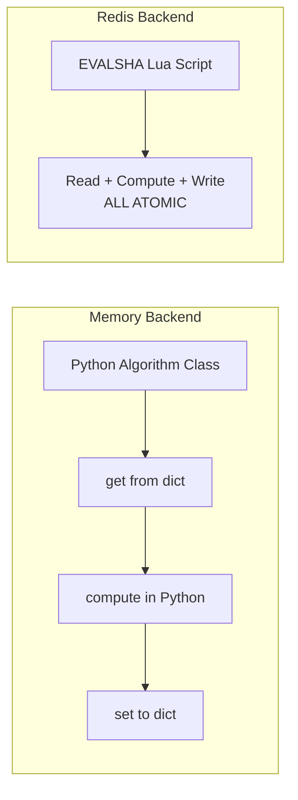
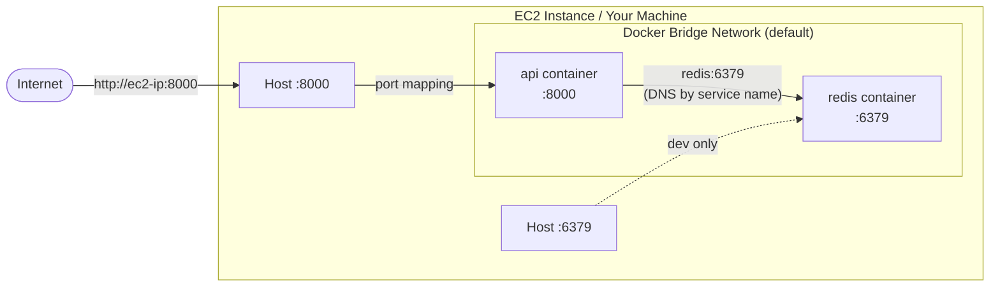
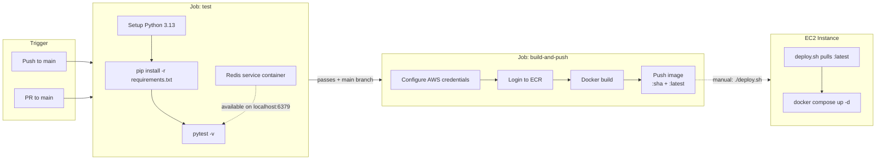

# Architecture

## System Overview



## Request Flow

Every rate limit check follows this path through the codebase:



### Step-by-step breakdown

1. **HTTP Layer** (`routers/check.py:11`): FastAPI receives the POST, validates the JSON body against `CheckRequest` (Pydantic). Invalid payloads get a 422 before any business logic runs.

2. **Service Lookup** (`services/rate_limiter_service.py:38-48`): The service retrieves the rule config from its in-memory `_rules` dict. If the rule doesn't exist, `RuleNotFoundError` is raised and the router converts it to a 404.

3. **Backend Routing** (`services/rate_limiter_service.py:46-48`): A `hasattr` check determines whether the storage backend supports atomic operations. Redis does; memory doesn't.

4. **Algorithm Execution**:
   - **Redis path** (`_check_atomic`): Calls one of three `atomic_*` methods on `RedisBackend`, which execute pre-loaded Lua scripts via `EVALSHA`.
   - **Memory path** (`_check_algorithm`): Instantiates the appropriate Python algorithm class and calls `consume()`, which does `get` -> compute -> `set` on the memory backend.

5. **Response** (`models/responses.py:4-9`): The result is wrapped in a `CheckResponse` Pydantic model and serialized to JSON.

## Redis Backend vs Memory Backend



| Aspect | Memory Backend | Redis Backend |
|--------|---------------|---------------|
| **File** | `storage/memory_backend.py` | `storage/redis_backend.py` |
| **Storage** | Python `dict` in process memory | Redis server (separate process) |
| **Atomicity** | Not needed (single process) | Lua scripts ensure atomic read-check-write |
| **Algorithm code** | Python classes in `algorithms/` | Lua scripts embedded in `redis_backend.py` |
| **Shared state** | No (each process has its own dict) | Yes (all API instances share one Redis) |
| **Persistence** | Lost on restart | Survives API restart (Redis has its own data volume) |
| **Use case** | Testing, single-process dev | Production, distributed deployments |

### Why two paths?

The memory backend exists so you can run the full test suite (`test_api.py`, algorithm unit tests) without a Redis server. The `test_redis_backend.py` tests gracefully skip if Redis isn't available. This keeps the development feedback loop fast.

In production, the Redis path is always used. The Lua scripts replicate the exact same logic as the Python algorithm classes but execute atomically inside Redis.

### The race condition problem

Without Lua, a distributed check looks like this:

```
Process A: GET counter -> 99
Process B: GET counter -> 99        # both read the same value
Process A: 99 < 100, INCR -> 100
Process B: 99 < 100, INCR -> 101   # over limit!
```

With Lua, the entire read-check-write is a single Redis operation — no interleaving possible.

## Docker Networking



### How containers find each other

Docker Compose creates a **bridge network** for all services in the compose file. Each service gets a DNS entry matching its service name.

In `docker-compose.yml`:
```yaml
environment:
  RATELIMITER_REDIS_HOST: redis    # <-- this is the service name, resolved by Docker DNS
  RATELIMITER_REDIS_PORT: 6379
```

The `api` container connects to Redis at `redis:6379`. Docker's embedded DNS server resolves `redis` to the Redis container's internal IP. No hardcoded IPs needed.

### Port mappings

| Service | Container Port | Host Port | Purpose |
|---------|---------------|-----------|---------|
| api | 8000 | 8000 | Exposed to the internet (via EC2 security group) |
| redis | 6379 | 6379 | Exposed for local dev only; in production, could remove this mapping |

### Health checks

Both containers have health checks:

- **Redis**: `redis-cli ping` every 5 seconds. The `api` container uses `depends_on: condition: service_healthy` to wait for Redis before starting.
- **API**: HTTP check on `/api/v1/health` every 10 seconds. Docker uses this to report container health status.

### Production differences

`docker-compose.prod.yml` differs from the dev `docker-compose.yml`:

| Aspect | Dev (docker-compose.yml) | Prod (docker-compose.prod.yml) |
|--------|--------------------------|-------------------------------|
| API image | `build: .` (builds locally) | `image: ${ECR_IMAGE}` (pulls from ECR) |
| Restart policy | None (default) | `restart: unless-stopped` |
| Source code | Needs Dockerfile + source | Only needs the compose file |

## CI/CD Pipeline Flow



### Job 1: Test

**Trigger:** Every push to `main` and every PR targeting `main`.

**What happens:**
1. GitHub Actions provisions an Ubuntu runner
2. Starts a Redis 7 service container (sidecar) with health checks
3. Sets up Python 3.13 with pip caching
4. Installs all dependencies from `requirements.txt`
5. Runs `pytest -v` with `RATELIMITER_REDIS_HOST=localhost` so both memory and Redis tests execute

**Why a service container?** The Redis tests (`test_redis_backend.py`) need a real Redis instance. GitHub Actions service containers run alongside the job and are accessible on `localhost`.

### Job 2: Build & Push

**Trigger:** Only on pushes to `main` (not PRs), and only after Job 1 passes.

**What happens:**
1. Configures AWS credentials from GitHub Secrets
2. Authenticates with ECR using `aws-actions/amazon-ecr-login`
3. Builds the Docker image using the multi-stage `Dockerfile`
4. Tags the image with both the commit SHA and `latest`
5. Pushes both tags to ECR

**Why two tags?**
- `:latest` — used by `deploy.sh` on EC2 for quick deploys
- `:<commit-sha>` — immutable reference for rollbacks; you can always deploy a specific commit

### Deployment (manual step)

The CI/CD pipeline deliberately does **not** auto-deploy to EC2. Deployment is triggered by running `deploy.sh` on the EC2 instance. This is intentional for a portfolio project on a free-tier instance — no need for a full continuous deployment pipeline when you control the single server.

### GitHub Secrets required

| Secret | Used by | Purpose |
|--------|---------|---------|
| `AWS_ACCESS_KEY_ID` | Job 2 | IAM user credentials for ECR push |
| `AWS_SECRET_ACCESS_KEY` | Job 2 | IAM user credentials for ECR push |
| `AWS_ACCOUNT_ID` | Job 2 | Constructs ECR registry URL |
| `ECR_REPOSITORY` | Job 2 | ECR repository name (e.g., `rate-limiter`) |

None of these appear in the codebase — they're injected at runtime by GitHub Actions.
